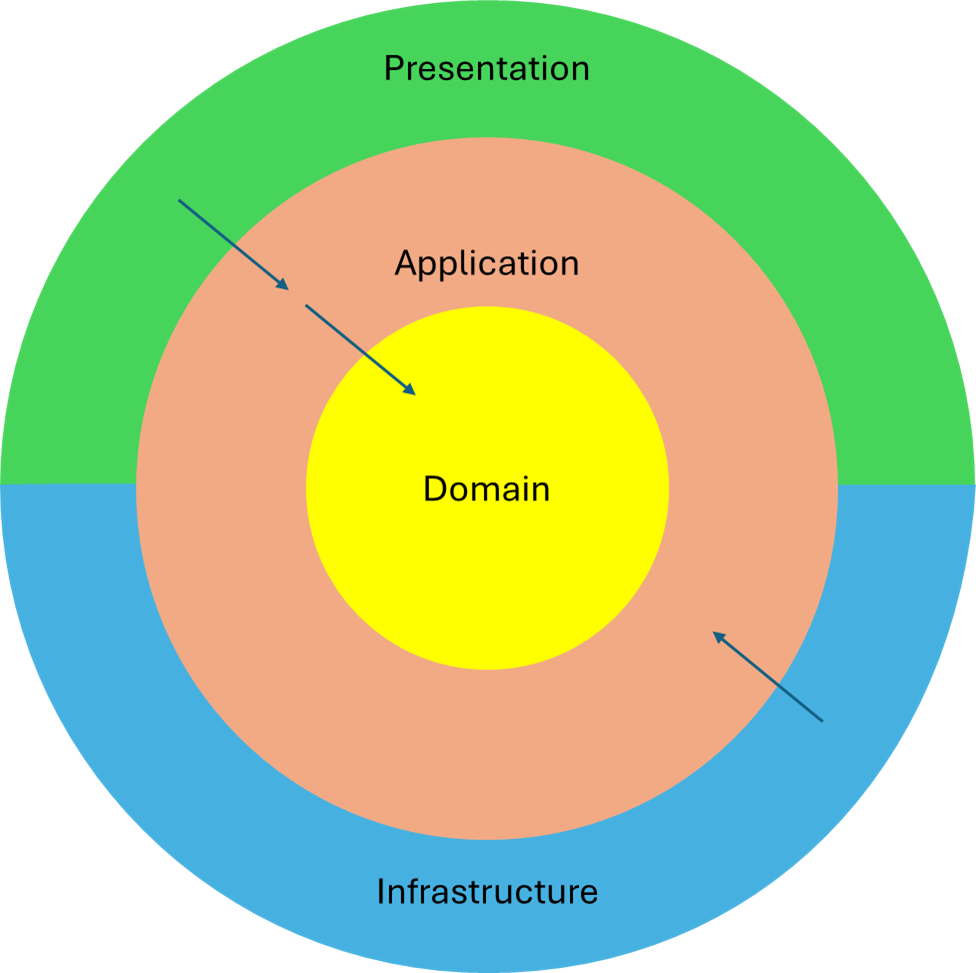

# PILOT Project

This project is a simple demonstration of how to implement the **CQRS pattern**, real-time communication using **Socket.IO**, and message queues with **RabbitMQ**. The purpose of this project is purely educational and does not aim to address or recommend any specific architecture.

---

## Project Architecture

While the primary goal of this project is to demonstrate CQRS, real-time communication, and message queues, it also loosely follows principles of **Clean Architecture** to organize the code. This approach ensures separation of concerns and makes the project easier to understand and extend. However, the implementation is simplified and does not strictly adhere to all Clean Architecture guidelines.

Clean Architecture, introduced by Robert C. Martin (Uncle Bob), is a software design philosophy that emphasizes separation of concerns and independence of frameworks, databases, and user interfaces. The architecture is structured in concentric layers, where the innermost layers are the most abstract and the outermost layers are the most concrete.

  
*Image credit: Robert C. Martin (Uncle Bob) - [The Clean Code Blog](https://blog.cleancoder.com/)*


- **Enterprise Business Rules (Entities)**: Represent the core business rules and are independent of any external systems.
- **Application Business rules (Use Cases)**: Contain the application-specific business rules and orchestrate the flow of data to and from entities.
- **Interface Adapters (Controllers, Gateways, presenters)**: Convert data from the format most convenient for use cases and entities to the format required by external systems.
- **Frameworks & Drivers ()**: Represent the outermost layer, including frameworks, databases, and external APIs.

*You can learn more about Clean Architecture at [The Clean Code Blog](https://blog.cleancoder.com/uncle-bob/2012/08/13/the-clean-architecture.html).*


###


Below is a simplified representation of Clean Architecture:




## Architecture Overview

This project is structured according to Clean Architecture principles:

- **Domain**: This layer contains the core business logic and domain models. It is completely independent of external systems, frameworks, or libraries. In this project, it includes the fundamental rules and data structures for real-time communication and message brokering.

- **Application**: This layer contains application-specific business rules and orchestrates the flow of data between the domain layer and the outer layers. In this project, it handles use cases such as processing WebSocket messages and managing RabbitMQ message flows.

- **Infrastructure**: This layer provides implementations for external systems and frameworks. It acts as an adapter for the application layer to interact with external dependencies. In this project, it includes:
  - Adapters for RabbitMQ to handle message brokering.
  - Integration with Socket.IO for WebSocket communication.
  - Other external systems or APIs required by the application.

- **Presentation**: This is the outermost layer responsible for interacting with the user or external systems. In this project, it includes:
  - The Node.js runtime and Express.js for handling HTTP requests and serving the application.
  - WebSocket connections managed via Socket.IO.
  - The RabbitMQ Management UI for monitoring and managing message queues.

---

## RabbitMQ Management UI

Access the RabbitMQ Management UI at [http://localhost:15672](http://localhost:15672)  
Default username/password: `guest/guest`

---

## Common Terminal Commands

Here are some commonly used commands for this project:

- Install dependencies:
  ```bash
  npm install
  ```

- Start the development server:
  ```bash
  npm run dev
  ```

- Start services with Docker:
  ```bash
  docker compose up -d
  ```

---

## Contributing

Contributions are welcome! Please follow the Clean Architecture principles when adding new features or refactoring existing code.

---

## License

This project is licensed under the MIT License. See the LICENSE file for details.